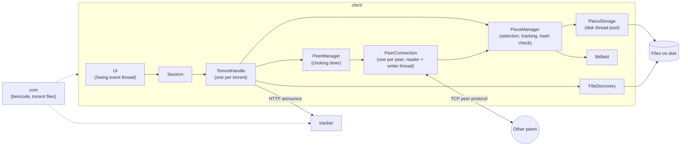

# weTorrent

- [Terminology](#terminology)
- [How torrenting works](#how-torrenting-works)
- [Components](#components)
- [Architecture](#architecture)

## Terminology

**Trackers** - central servers that coordinate between users/peers who are downloading and uploading files. They're contacted by a user who wants to find the people who are sharing a file and it's how you tell the swarm that you have pieces to share with others.

**Swarm** - connected group of all users/peers downloading and sharing the same file.

**Seeder** - user/peer that has the full file and continues sharing it with others. Uploads only, no downloading.

**Leecher** - users/peers that are currently downloading pieces and sharing what they already have.

**Infohash** - a 20-byte unique identifier of the torrent. It’s what peers use to find each other, what trackers use to group peers, and what the DHT uses as the lookup key. Changing even one byte of the file contents changes the infohash, making counterfeiting or tampering detectable. It is computed by hashing the b-encoded info dictionary using SHA-1. Although SHA-1 considered cryptographically weak for collision resistance (2^61 operations). So SHA-256 preferred.

## How torrenting works

Torrenting works by sharing pieces of a file directly between users (P2P) instead of downloading it from a single central server.

1. A user creates a torrent in the torrent client, specifying the downloadable file on their system. This creates a torrent file (or magnet URI).
2. To participate in torrenting a file, you need to have a torrent file containing the metadata of the file to download.
3. When you "run" the torrent file in the torrent client, it establishes connections between participating peers using the tracker/announce and infohash.
4. BitTorrent handshake: To connect with peers, a header is sent to all peers. The header is 68 bytes:
| "19" (1B) | "BitTorrent protocol" (19B) | protocol extensions, empty (8B) | info hash (20B) | peer id (20B) |
5. The peer that receives the header validates it (length, infohash, etc.) and returns their peer ID and infohash.
6. The returned information is validated by the initiating peer. If everything is valid, the handshake is successful. If the infohash sent by both sides doesn't match, the connection is severed.
7. The first message that is shared is the bitfield. The bitfield represents which pieces each peer currently has, with each bit corresponding to a piece index.
8. Each peer determines which pieces it needs based on the pieces available from connected peers. Pieces are selected using two strategies: random-first and rarest-first. The very first downloaded pieces use the random-first strategy because the peer has nothing to upload yet and therefore can't contribute to the swarm.
9. Once a peer has a piece that another peer needs, the peer can express interest in downloading from it. The choking algorithm is then used to determine which interested peers are allowed to request data.
10. The interested peer sends multiple request messages for blocks of the needed piece. The peer providing the data responds with piece messages containing the requested blocks.
11. Once all blocks belonging to a piece have been downloaded, the piece is reconstructed and its SHA-1 hash is checked against the corresponding hash from the torrent metadata.
12. If the piece is valid, the peer marks the piece as complete and sends a have message to its connected peers so they know it now has that piece.
13. As more pieces become available, peers continue selecting pieces, requesting blocks, validating completed pieces, and announcing newly completed pieces to the swarm.
14. Once all pieces have been downloaded and validated, the peer has the complete file and becomes a seeder, continuing to upload pieces to other peers.

When a torrent is created, the source file is split into fixed-size pieces (256KB - 4MB).

For a 5 GB file with 1 MB pieces, there are 5,120 pieces. Each piece has a 20-byte SHA-1 hash stored in the .torrent file’s info dictionary. The total hash data for this torrent would be:
5,120 pieces × 20 bytes = 102,400 bytes ≈ 100 KB of hash data.

Each peer maintains a bitfield, a binary array where bit N represents whether the peer has piece N. A 5,120-piece torrent has a 5,120-bit (640-byte) bitfield. When two peers connect, they exchange their bitfields so each knows what the other has.

## Components

### Torrent file

Torrent file contains all the metadata needed to torrent:
- announce (tracker url or DHT)
- info dictionary:
	- **'name'** key maps to a UTF-8 encoded string which is the suggested name to save the file (or directory) as. In the single file case, it is the name of a file, in the multiple file case, it's the name of a directory.
	- **'piece length'** maps to the size of a piece in bytes. Most commonly 256K.
	- **'pieces'** maps to a string whose length is a multiple of 20. It is to be subdivided into strings of length 20, each of which is the SHA1 hash of the piece at the corresponding index.
	- There is also a key **'length'** or a key **'files'**, but not both or neither.
      - If length is present then the download represents a single file.
      - Otherwise it represents a set of files which go in a directory structure.
      - In the single file case, length maps to the length of the file in bytes.
      - For the purposes of the other keys, the multi-file case is treated as only having a single file by concatenating the files in the order they appear in the files list.
      - The files list is the value files maps to, and is a list of dictionaries containing the following keys: length - The length of the file, in bytes. path - A list of UTF-8 encoded strings corresponding to subdirectory names, the last of which is the actual file name (a zero length list is an error case).

### Trackers

Trackers are central servers that coordinate between users/peers who are downloading and uploading files. They're contacted by a user who wants to find the people who are sharing a file, and it's how you tell the swarm that you have pieces to share with others.

Tracker `GET` requests have the following keys:
- **info_hash**: 20-byte sha1 hash of the bencoded form of the info dictionary from the torrent file.
- **peer_id**: string of length 20. Each peer generates its own id at random at the start of a new download.
- **ip**: optional parameter giving the IP (or dns name) which this peer is at. Generally used for the origin if it's on the same machine as the tracker.
- **port**: port number this peer is listening on. Common behavior is for a downloader to try to listen on port 6881 and if that port is taken try 6882, then 6883, etc. and give up after 6889.
- **uploaded**: total amount uploaded so far, encoded in base ten ascii.
- **downloaded**: total amount downloaded so far, encoded in base ten ascii.
- **left**: number of bytes this peer still has to download, encoded in base ten ascii.
- **event**: optional key which maps to started, completed, or stopped (or empty, which is the same as not being present). If not present, this is one of the announcements done at regular intervals. An announcement using started is sent when a download first begins, and one using completed is sent when the download is complete. No completed is sent if the file was complete when started. Downloaders send an announcement using stopped when they cease downloading.

A tracker can keep track of multiple torrents based on its infohash. Infohashes can be mapped to a set of peers.

Tracker responses are bencoded dictionaries. If a tracker response has a key `failure reason`, then that maps to a human-readable string which explains why the query failed, and no other keys are required. Otherwise, it must have two keys: `interval`, which maps to the number of seconds the downloader should wait between regular rerequests, and `peers`. Peers maps to a list of dictionaries corresponding to peers, each of which contains the keys peer id, ip, and port, which map to the peer's self-selected ID, IP address or dns name as a string, and port number, respectively.
More commonly is that trackers return a compact representation of the peer list. To reduce the size of tracker responses and to reduce memory and computational requirements in trackers, trackers may return peers as a packed string rather than as a bencoded list. It is suggested now to use a compact format where each peer is represented using only 6 bytes. The first 4 bytes contain the 32-bit ipv4 address. The remaining two bytes contain the port number. Both address and port use network-byte order.

### Peer protocol

BitTorrent's peer protocol operates over TCP or uTP. Peer connections are symmetrical. Messages sent in both directions look the same, and data can flow in either direction.

The peer protocol refers to pieces of the file by index as described in the metainfo file, starting at zero.

Connections start out choked and not interested.

When data is being transferred, downloaders should keep several piece requests queued up at once in order to get good TCP performance (this is called 'pipelining'.) On the other side, requests which can't be written out to the TCP buffer immediately should be queued up in memory rather than kept in an application-level network buffer, so they can all be thrown out when a choke happens.

Messages sent/received consist of:

| length (4B) | message type (1B) | payload (variable length) |

Message types:
- 0 - choke - stop sending requests to this peer
- 1 - unchoke - resume accepting requests
- 2 - interested - signal willingness to download
- 3 - not interested - no needed pieces from this peer
- 4 - have - announce completion of piece
- 5 - bitfield - send bitfield
- 6 - request - request a block (piece index, offset/begin, length)
- 7 - piece - deliver a block (piece index, offset, block data)
- 8 - cancel - cancel a previously sent request

Before requesting/sending pieces, they're further divided into blocks.

1. Handshake with all peers. A 68-byte header is sent: | 19 (1B) | "BitTorrent protocol" (19B) | protocol extensions, empty (8B) | info hash (20B) | peer id (20B) |. If both sides don't send same sha1 info hash, they sever the connection. If the receiving side's peer id doesn't match the one the initiating side expects, it severs the connection.
2. Connections start out choked and not interested. Each side maintains two bits of state on either end: choked or not, and interested or not.
3. Send `bitfield` message to all other peers.
4. Send multiple `request` messages (each representing a block) to a peer that has a needed piece based on piece selection algorithm (random first, then rarest first)
5. When a piece download is complete, check whether the hash matches and send a `have` message containing the index of the downloaded piece to all peers.
6. Send a `piece` message when receiving a `request` message.

Data transfer takes place whenever one side is interested and the other side is not choking. Interest state must be kept up to date at all times - whenever a downloader doesn't have something they currently would ask a peer for in unchoked, they must express lack of interest, despite being choked. Implementing this properly is tricky, but makes it possible for downloaders to know which peers will start downloading immediately if unchoked.

When data is being transferred, downloaders should keep several piece requests queued up at once in order to get good TCP performance (this is called 'pipelining'.) On the other side, requests which can't be written out to the TCP buffer immediately should be queued up in memory rather than kept in an application-level network buffer, so they can all be thrown out when a choke happens.

### Choking algorithm

To prevent peers from abusing the protocol by downloading files without contributing anything to the swarm, the choke algorithm is used.

Suppose peer B is abusing the protocol by downloading from peer A without uploading anything. In this case, peer A chokes peer B, blocking peer B from downloading anything from peer A, while peer A still has the power to download from peer B.

Doing this, the network traffic relaxes, and it makes it more fair for every participant of the network.

## Architecture

### Modules

- **core** - shared code used by both the client and the tracker. Bencoding, reading and writing torrent files, and tracker request/response types.
- **client** - the torrent client and its UI.
- **tracker** - a simple HTTP tracker that keeps a list of peers for each infohash.

### Client classes

- **Session** - holds all added torrents, the peer ID and the thread pools.
- **TorrentHandle** - one per torrent. Checks which pieces already exist on disk, contacts the tracker and connects to the returned peers.
- **PeerManager** - keeps all peer connections of a torrent. Runs the choking algorithm and sends a `have` message to all peers when a piece is done.
- **PeerConnection** - one per connected peer. Does the handshake, handles incoming messages and sends messages.
- **PieceManager** - decides which pieces to download, keeps track of them and checks the hash of finished pieces.
- **Bitfield** - which pieces a peer has. There is one for us and one for every connected peer.
- **FileDiscovery** - checks which pieces are already on disk when a torrent starts.
- **PieceStorage** - reads and writes pieces to the files on disk.

### Concurrency

- The UI runs on the Swing event thread. Other threads update the UI through `SwingUtilities.invokeLater`.
- Network work runs on vthreads. Each torrent has one thread that accepts incoming connections. Each connected peer has two threads:
	- **reader** - reads messages from the socket and handles them.
	- **writer** - takes messages from a queue and sends them.
- The reader never waits on sending. Without this, two peers that upload to each other at the same time could both get stuck waiting to send while nobody reads.
- Disk work runs on a threadpool of 2 platform threads. Vthreads don't help here because file I/O blocks the thread under them anyway. Reads and writes return a `CompletableFuture`, so network threads never wait on the disk.
- Each torrent has one timer thread that runs every 10 seconds. It runs the choking algorithm, cancels requests that timed out and sends keep-alive messages.
- Shared state like the bitfields and the piece tracking is protected with locks.

### Piece selection and tracking

- Pieces are split into 16 KB blocks. Blocks are what get requested from peers.
- The client counts how many connected peers have each piece.
- Rarest-first algorithm - the piece that the fewest peers have is picked next. If many pieces are equally rare, one of them is picked at random.
- Unfinished pieces left behind by a peer that choked us or disconnected are finished before new pieces are started.
- A piece that is being downloaded belongs to one peer, so two peers are never asked for the same block.
- When all blocks of a piece have arrived, its SHA-1 hash is checked. If it matches, the piece is written to disk, marked as done and a `have` message is sent to all peers. If not, the piece is downloaded again.

### Pipelining

- Up to 10 block requests are sent to a peer at once instead of waiting for each block to arrive.
- Every time a block arrives, a new request is sent, so there are always requests waiting.
- If a peer sends nothing for 60 seconds, its requests are cancelled and its pieces are given to other peers.

### Choking

- Every 10 seconds, the 3 interested peers with the best rate are unchoked. While downloading, those are the peers that upload the most to us. While seeding, those are the peers that download the most from us.
- Every 30 seconds, one more random interested peer is unchoked. This is called an optimistic unchoke and gives new peers a chance.
- If a peer becomes interested and there is a free slot, it is unchoked right away.
- Choking a peer throws away all of its queued requests.

### Uploading

- A `request` is only accepted if we are not choking the peer and we have the piece. A block can be at most 16 KB.
- The block is read from disk on a disk thread. When it's read, a `piece` message is added to the send queue.
- A `cancel` message removes the request if it hasn't been sent yet.

### Disk storage

- Files are opened once and stay open while the torrent runs.
- In a multi-file torrent, a piece can cover the end of one file and the start of the next. Reads and writes are split across those files.
- Files are set to their full size on the first write. When the torrent starts again, FileDiscovery checks which pieces are already there, so the download continues where it stopped.
